# Assignment 2: Robotic Body and Camera movement

## **Team 15**

**Team Members:-**


| Name      | Sec | BN     |
| :---        |    :----:   |          ---: |
| Alaa Seif elnasr Ibrahim | 1       | 11   |
| Amany Yasser Taha        | 1       | 14   |
| Awatef Ahmed Hasan       | 2       | 4    |
| Mariam Glal Mohamad      | 2       | 24   |
| Walaa Salah Abd ellatef  | 2       | 44   |

---

 # Operation Steps
### 1- Robotic body <br>
that by using cubes and solid sphere.
 
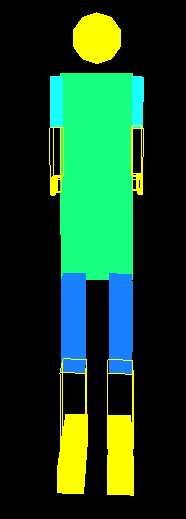

### 2- Applying rotation for x and z axises for sholder and elbow 

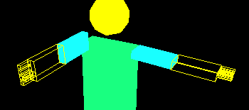 
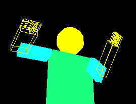

 that by using following lines: 
```cpp
  //right arm
    glPushMatrix();
    glTranslatef(-0.8, 1.9, 0);
    glRotatef(rightarmz, 0.0, 0.0, 1.0);
    glRotatef((GLfloat)rightarm, 1.0, 0.0, 0.0);
    glTranslatef(0, -0.45, 0);
    glColor3f(0.1, 1.0, 1.0);
    glPushMatrix();
    glScalef(0.2, 1.0, 0.5);
    glutSolidCube(1);
    glPopMatrix();
    //right elbow 
    glTranslatef(0, -0.45, 0.0);
    glRotatef((GLfloat)rightelbowz, 0.0, 0.0, 1.0);
    glRotatef((GLfloat)rightelbow, 1.0, 0.0, 0.0);
    glTranslatef(0, -0.55, 0.0);
    glColor3f(2.0, 2.0, 0.0);
    glPushMatrix();
    glScalef(0.2, 1.0, 0.5);
    glutWireCube(1);
    glPopMatrix();
```
 ### 3- Applying rotation for axises for hip and knee

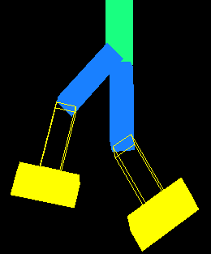 
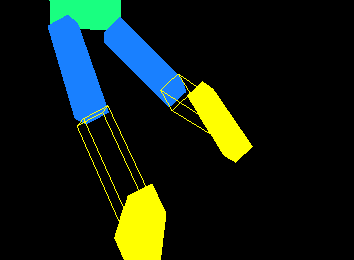

that by using following lines: 

```cpp
   //right leg
    glPushMatrix();
    glTranslatef(-0.537, -2, 0);
    glRotatef((GLfloat)rightlegz, 0.0, 0.0, 1.0);
    glRotatef(rightleg, 1.0, 0.0, 0.0);
    glTranslatef(0.07, -0.95, 0);
    glColor3f(0.1, 0.5, 1.0);
    glPushMatrix();
    glScalef(0.466, 1.8, 0.5);
    glutSolidCube(1);
    glPopMatrix();
    //right lowerleg 
    glTranslatef(0, -.825, 0.0);
    glRotatef((GLfloat)lowerrightleg, 1.0, 0.0, 0.0);
    glTranslatef(0, -.825, 0.0);
    glPushMatrix();
    glColor3f(2.0, 2.0, 0.0);
    glScalef(0.5, 1.5, 0.5);
    glutWireCube(1);
    glPopMatrix();
 ```

### 4- Applying camera translations to control:<br>
 i- zoom in and out<br>
 ii- rotate around z axis<br>
iii- rotate around x axis<br>
as shown in figues

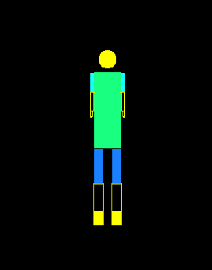 
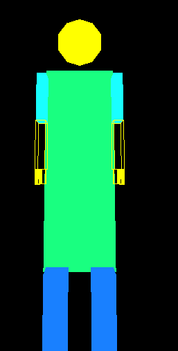
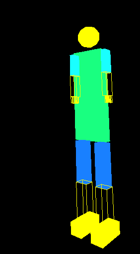
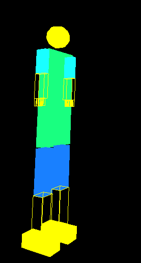
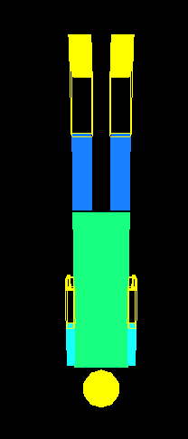
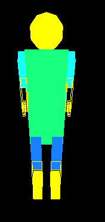


---
# Shortcuts for movements:
|Key|           Actions          | 
|:---:|:------------------------:|
|  <kbd>&larr;</kbd> | Left |
| <kbd>&rarr;</kbd>  |  Right |
| <kbd>&uarr;</kbd> | Up |
| <kbd>&darr;</kbd>  |  Down |
|  r| Reset |
|  f | forward |
|  b | backward|
|  z & Z| rightarm around the x-axis |
|  x & X| rightarm around the z-axis |
|  c & C| rightelbow around the x-axis|
|  v & V| rightelbow around the z-axis |
|  n & N| rightfingers |
|  h & H| leftarm around the x-axis |
|  j & J| leftarm around the z-axis |
|  k & K| leftelbow around the x-axis |
|  l & L| leftelbow around the z-axis |
|  m & M| leftfingers|
|  q & Q| rightleg around the x-axis |
|  w & W| rightleg around the z-axis |
|  e & E| lowerrightleg |
|  i & I| leftleg around the x-axis |
|  o & O| leftleg around the z-axis |
|  p & P| lowerleftleg |

---
# RESULT
### Here some motion that robot can do.
<p float="left">
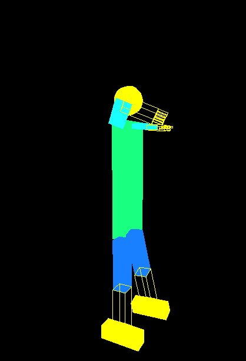 
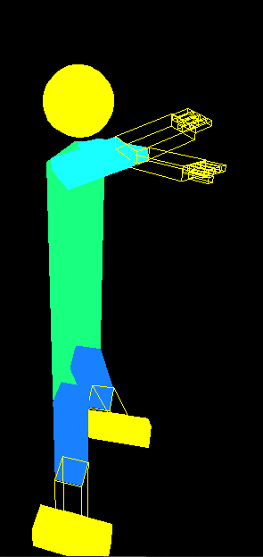
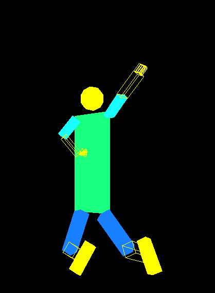
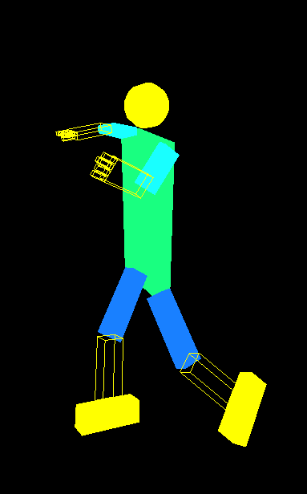
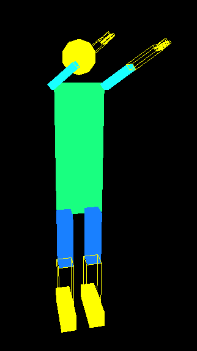

---
